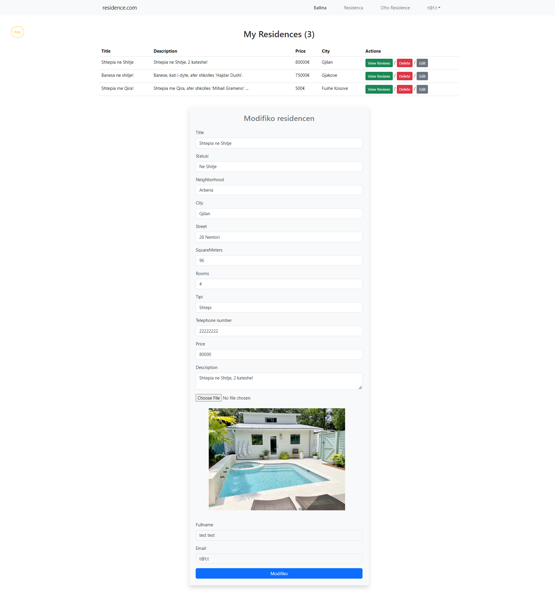
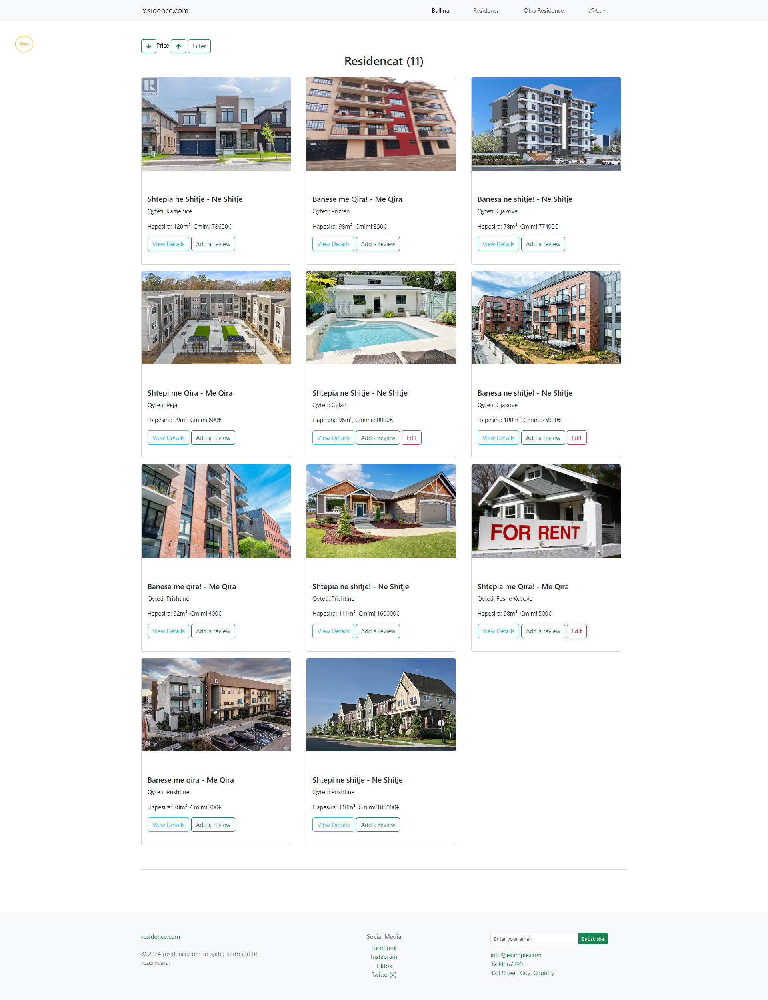

# residence.com

## Permbledhje
`residence.com` eshte nje aplikacion web i dizajnuar per vleresim dhe shitje apo dhenie me qira te shtepive dhe apartamenteve. Lejon perdoruesit te krijojne llogari, te kyçen, te shtojne, te modifikojne dhe te fshijne residencat e tyre. Perdoruesit gjithashtu mund te shfletonin dhe te vleresonin shtepite/apartmentet e shtuara nga perdorues te tjere. Perdoruesit admin kane qasje ne nje panel kontrolli per te menaxhuar te dhenat e perdoruesve, shtepite dhe vleresimet.

## Karakteristikat

- **Autentikimi i Perdoruesit**: Regjistrimi i sigurt dhe funksionaliteti i kyçjes per perdoruesit.

- **Menaxhimi i Shtepive/Apartmenteve**:
  - Shtoni, modifikoni dhe fshini shtepite/apartmentet.
  
  
  - Shikoni dhe vleresoni shtepite/apartmentet e shtuara nga perdorues te tjere.
  
  

- **Menaxhimi i Vleresimeve**:
  - Shtoni, modifikoni dhe fshini vleresime per shtepite/apartmentet.
    
    

- **Menaxhimi i Llogarise**:
  - Modifikoni informacionin e profilit te perdoruesit.
    
  - Fshini llogarine e perdoruesit (fshihen automatikisht shtepite/apartmentet dhe vleresimet e lidhura).
    
- **Paneli i Adminit**:
  - Qasje ne panelin e adminit me privilegje per te menaxhuar perdoruesit, shtepite dhe vleresimet.
    
    
    
    
    

## Teknologjite e Perdorura
- **Frontend**: HTML, CSS, Bootstrap per dizajnin e pershtatshem.
- **Backend**: PHP per pjesen e serverit.
- **Baza e te Dhenave**: MySQL.

## Instalimi
Per te ekzekutuar `residence.com` lokal, ndiqni keto hapa:
1. Klononi repositorin: `git clone https://github.com/hajrijemjeku/residence.com`
2. Shkoni ne drejtorine e projektit: `cd residence.com`
3. Importoni skemen e bazes se te dhenave dhe te dhenat fillestare nga `sql/residencedb.sql` ne bazen tuaj MySQL.
4. Konfiguroni lidhjen me bazen e te dhenave ne `includes/db.php`.
5. Startoni serverin tuaj PHP per zhvillim ose konfiguroni me Apache/Nginx sipas nevojes.

## Perdorimi
1. Startoni serverin PHP.
2. Vizitoni `http://localhost/residence.com` ne shfletuesin tuaj web.
3. Regjistrohuni per nje llogari te re ose kyçuni me kredencialet ekzistuese.
4. Eksploroni dhe perdorni karakteristikat bazuar ne rol te perdoruesit tuaj (perdorues ose admin).

